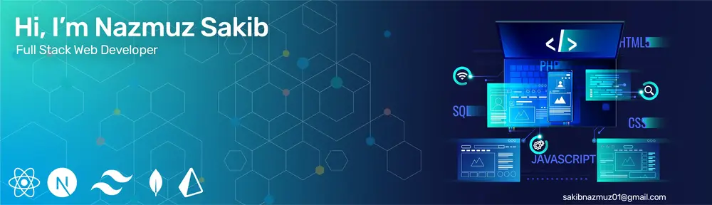

  

I'm a Full Stack web developer skilled specially in React, NextJs, Node.js, MongoDB and Prisma. I'm Continuously learning and adapting to new technologies and industry best practices. I'm currently doing B.Sc in Mathematics at the University of Rajshahi.

---

**:busts_in_silhouette: Social Media:**

$~~~$
$~~~$
$~~~$
$~~~$

 

**:chart_with_upwards_trend: My Stats:**

 

 

 

**:computer: Skills:**

 
   $~~~$
   $~~~$
  $~~~$
   $~~~$
   $~~~$
  $~~~$
 $~~~$
  $~~~$
  $~~~$
   $~~~$
  $~~~$
  $~~~$
   $~~~$
  $~~~$
  $~~~$

 

**🧑‍💻: Tech I most use:**
 
 
I love using Next.js for my frontend projects, combined with Tailwind CSS and Shadcn UI to create sleek, responsive designs. In my React projects, I use Tanstack Query for smooth data fetching. For backend development, I go with Express.js, and MongoDB is my go-to database.

 

**:eyes: Projects:**

- 👨‍💻 All of my projects are available at [My-Portfolio](https://nazmuz-sakib-portfolio.vercel.app)

   

**🧑‍💻: Currently Working On:** My Gadgets Ecommerce Store
- [Frontend](https://github.com/NaZmuZ-SaKiB/My-Gadgets) Technologies: Typescript, NextJs, TailwindCSS, Shadcn UI, Tanstack Query, React Hook Form, Zod, Cloudinary, Stripe
- [Backend](https://github.com/NaZmuZ-SaKiB/My-Gadgets-Server) Technologies: Typescript, NodeJs, ExpressJs, Mongoose, Jose, Zod

**:mailbox: How to reach me**

- **Email:** sakibnazmuz01@gmail.com
  
- **Phone:** +88 01998008666
